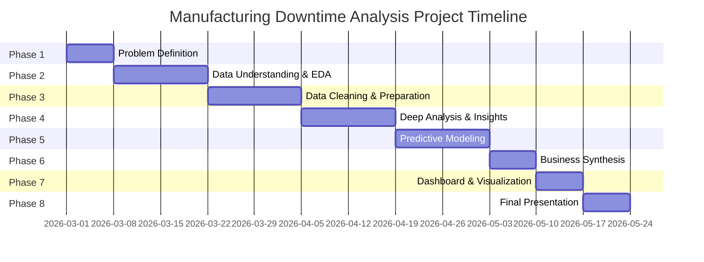

# 🏭 Manufacturing Downtime Analysis & Forecasting

[](https://www.python.org/)
[](https://pandas.pydata.org/)
[](https://scikit-learn.org/)
[](https://www.tableau.com/)
[](LICENSE)

---

## 📋 Table of Contents
- [Project Overview](#project-overview)
- [Project Idea](#project-idea)
- [Key Objectives](#key-objectives)
- [Tools & Technologies](#tools--technologies)
- [Dataset Description](#dataset-description)
- [Project Workflow](#project-workflow)
- [Project Timeline](#project-timeline-12-weeks)
- [Project Insights](#project-insights)
- [Team Members](#team-members)
- [Roles & Responsibilities](#roles--responsibilities)
- [KPIs](#kpis)
- [Instructor](#instructor)
- [Future Improvements](#future-improvements)
- [Installation](#installation)
- [Project Files](#project-files)
- [Contact](#contact)

---

## 📖 Project Overview

Manufacturing downtime is one of the main factors affecting production efficiency and operational costs. This project analyzes manufacturing line productivity data to identify downtime patterns, understand the main causes of operational interruptions, and forecast future downtime to improve production planning.

Using data analysis and machine learning techniques, this project provides insights that help decision-makers reduce downtime and optimize manufacturing operations.

---

## 💡 Project Idea

This project aims to analyze historical manufacturing data to identify the root causes of machine downtime, detect patterns across different shifts and machines, and build a forecasting model to predict future downtime. The final output includes actionable insights and an interactive dashboard to support data-driven decision-making in production planning and maintenance scheduling.

---

## 🎯 Key Objectives

- 🔄 Clean and preprocess manufacturing productivity data
- 📊 Analyze downtime patterns across machines and shifts
- 🔍 Identify factors affecting operational efficiency
- 🤖 Forecast future downtime using machine learning
- 📈 Build a visualization dashboard for operational insights

---

## 🛠️ Tools & Technologies

| Category | Technologies |
|----------|-------------|
| **Programming** | Python |
| **Data Processing** | pandas, SQL |
| **Visualization** | Matplotlib, Tableau |
| **Machine Learning** | scikit-learn |
| **Development** | Jupyter Notebook |

---

## 📊 Dataset Description

The dataset contains manufacturing productivity data including:
- Machine operation metrics
- Downtime events
- Production batch data
- Operational performance indicators

These variables help analyze machine efficiency and identify the key causes of downtime.

---

## 🔄 Project Workflow

### 1. 🧹 Data Cleaning & Preprocessing
- Handling missing values
- Data formatting and transformation
- Building a structured dataset for analysis

**Tools used:** Python (pandas), SQL

---

### 2. 📈 Exploratory Data Analysis (EDA)

Exploratory analysis was performed to answer key operational questions such as:

- Which machines experience the highest downtime?
- What are the most common causes of downtime?
- How does downtime affect production output?
- Which shifts have the lowest operational efficiency?

**Tools used:** Python (pandas, Matplotlib)

---

### 3. 🔮 Forecasting Analysis

Machine learning models were used to predict future downtime trends.

Forecasting tasks include:
- Predicting expected downtime for the next day of operation
- Estimating production batch capacity based on predicted downtime

**Tools used:** Python (scikit-learn)

---

### 4. 📊 Data Visualization Dashboard

An interactive **Tableau dashboard** was developed to visualize:
- Downtime trends
- Machine efficiency comparison
- Production performance
- Forecasting insights

This dashboard helps decision-makers quickly identify operational issues.

---

## 📅 Project Timeline (12 Weeks)

| Phase | Duration | Focus | Key Tasks |
|-------|----------|-------|-----------|
| **Problem Definition** | Week 1 | Business Understanding & Objective Setting | • Understand production goals and KPIs<br>• Define key questions<br>• Define success metrics |
| **Data Understanding & EDA** | Weeks 2-3 | Initial Exploration & Quality Check | • Load and inspect all four sheets<br>• Check for missing values, duplicates<br>• Summary statistics |
| **Data Cleaning & Preparation** | Weeks 4-5 | Dataset Engineering | • Clean dataset fields and calculate batch duration<br>• Merge downtime data<br>• Create new features |
| **Deep Analysis & Insights** | Weeks 6-7 | Exploratory Analysis & Pattern Detection | • Analyze downtime by operator, product, time<br>• Identify top downtime factors<br>• Visualize comparisons |
| **Predictive Modeling** | Weeks 8-9 | Predictive Insights (Optional) | • Predict downtime likelihood or batch duration<br>• Use models like Random Forest<br>• Evaluate feature importance |
| **Business Synthesis** | Week 10 | Translating Insights into Action | • Summarize key findings<br>• Identify training needs<br>• Recommend process improvements |
| **Dashboard & Visualization** | Week 11 | Interactive Reporting | • Build an interactive dashboard<br>• Show downtime trends and operator performance<br>• Add filters |
| **Final Presentation & Delivery** | Week 12 | Stakeholder Presentation | • Prepare a concise presentation<br>• Deliver final report and dashboard |

> 📌 **Focus Area:** Manufacturing Line Productivity

---

## 📊 Visual Project Timeline



---

## 💡 Project Insights

The analysis helps manufacturing managers to:

- 🔍 Detect machines with frequent downtime
- ⚡ Identify operational inefficiencies
- 📅 Improve maintenance planning
- 🎯 Optimize daily production scheduling

---

## 👥 Team Members

1. **Malak Zein** – Team Leader  
2. **Sara Akram Adel**  
3. **Maryam Yahia Mohamed**  
4. **Maryam Sayed Salem**  
5. **Jasmin Wahid Mansour**  
6. **Abdelrahman Ibrahim Mohamed**

---

## 📋 Roles & Responsibilities

| Member | Responsibilities |
|--------|------------------|
| **Malak Zein** | • Overall project supervision and progress tracking<br>• Task distribution and team coordination<br>• Communication with the instructor and presenting periodic reports<br>• Reviewing final deliverables and ensuring quality |
| **Maryam Sayed Salem** | • Data cleaning and preprocessing<br>• Building forecasting models (Machine Learning)<br>• Evaluating model performance |
| **Sara Akram Adel** | • Exploratory Data Analysis (EDA)<br>• Creating charts and visualizations<br>• Detecting patterns in downtime periods |
| **Maryam Yahia Mohamed** | • Defining success metrics (KPIs)<br>• Translating results into actionable recommendations<br>• Preparing reports and presentations |
| **Jasmin Wahid Mansour** | • Building interactive dashboards<br>• Adding filters and interactive elements<br>• Ensuring the dashboard answers project questions |
| **Abdelrahman Ibrahim Mohamed** | • Code review and quality assurance<br>• Documenting project steps and methodology<br>• Updating project files on GitHub |

---

## 📊 KPIs (Key Performance Indicators)

> Metrics used to measure project success:

- ✅ **Model Accuracy**: RMSE or MAE for forecasting model
- ✅ **User Adoption Rate**: Number of dashboard views / stakeholders reached
- ✅ **Data Quality**: Percentage of missing data handled
- ✅ **Response Time**: Time taken to generate insights after query
- ✅ **Reduction in Unplanned Downtime** (if applied in real-time)

---

## 🧑‍🏫 Instructor

**Under the supervision of:**  
**Dr. Dina Ezzat**

---

## 🚀 Future Improvements

- [ ] Apply advanced forecasting models (LSTM, Prophet)
- [ ] Implement real-time monitoring dashboards
- [ ] Integrate predictive maintenance models
- [ ] Add more data sources for comprehensive analysis

---

## ⚙️ Installation

```bash
# Clone the repository
git clone https://github.com/mariamsayedsalem/Manufacturing-Downtime-Analysis-Forecasting.git

# Navigate to project directory
cd Manufacturing-Downtime-Analysis-Forecasting

# Install dependencies
pip install -r requirements.txt

# Run Jupyter notebooks
jupyter notebook notebooks/
```

---

## 📁 Project Files

You can access all project files, datasets, and notebooks here:  
🔗 **[GitHub Repository](https://github.com/mariamsayedsalem/Manufacturing-Downtime-Analysis-Forecasting)**

---

## 📬 Contact

If you would like to collaborate, discuss data projects, or professional opportunities, feel free to reach out.

<p align="left">

<a href="mailto:mariems00000@gmail.com">

</a>

<a href="tel:+201128533281">

</a>

<a href="https://github.com/mariamsayedsalem">

</a>

<a href="https://www.linkedin.com/in/maryam-sayed-salem-6265702a7">

</a>

</p>

---

## ⭐ Support

If you found this project useful, please consider giving it a star on GitHub!

---
**© 2026 Manufacturing Downtime Analysis Team. All Rights Reserved.**
